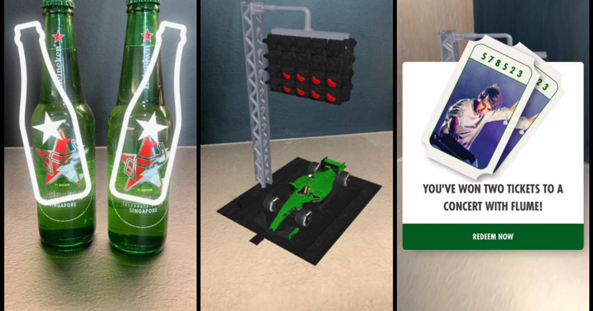

A web app that blended augmented reality and artificial intelligence to create an interactive user experience for the [Heineken® Formula 1](https://www.heineken.com/formula-1) campaign.
The campaign was the first time a brand has used web-based AR technology to power a live competition globally. 

 

---

## Project Goal 

In June I was contracted to develop the image recognition component of the [Heineken® AR Cheers Campaign](https://www.justaftermidnight247.com/case-study/heineken-ar-cheers-campaign/). 
I was given six weeks to create the Heineken® logo detection logic, which needed to fit the following criteria: 
1. Be lightweight, and quick enough to operate over a mobile browser without exceeding user bandwidth limits 
2. Able to accurately detect multiple variant Heineken® logos in the same picture
3. Recognize the following logos: 


## Challenges

##### Recognizing Each Heineken® Logo

One of the most important, and most challenging, aspects of any machine learning project is the training data. The more varied data you have, the more accurate the end result will be 
in a production environment. Finding photos of beer online isn't an issue, [Untappd](https://untappd.com/) has an active user base logging each time they drink a beer with an accompanying photo, and after some quick
web scraping and cleaning, I was able to generate a training set containing thousands of unique Heineken® photos. The issue was that the Heineken® F1 Singapore
bottle was unreleased at the time, which means it wasn't on Untappd, meaning all the training data for it had to be created. 

Luckily, we were shipped sample F1 bottles to train with. However, only so many images can be generated in-house, and they certainly wouldn't get close to replicating the production environment. 
We did our best, creating around 500 images of the F1 bottle in different scenarios (outside, inside, on the street, in nature, etc) with different viewing angles and liquid levels. 
Still, 500 images pales in comparison to the thousands of other Heineken® samples, which would've lead to an unbalanced model leaning heavily towards everything except the F1 bottle. 
Somehow we needed to come up with more training data to round out the final model, but production was running tight and we could only spend so long collecting data.

The solution was to utilize OpenCV to programmatically introduce randomness to the photos we'd already taken, creating a close-enough representation of different environments. 
The following features were randomly changed, with an allowance of 5% variance, in order to create the rest of the F1 dataset: horizontal flip, crop, scale, brightness, contrast, hue, saturation,
color, and noise. The end result was a dataset closely matching what was scraped from Untappd, both in size and image variance. 

##### Detecting Multiple Logos 

After training the intial dataset for a hundred thousand iterations I ran it through some test videos and immediately noticed some issues. 
With all of our training data primarily being single objects, the model had no exposure detecting multiple logos at the same time. Good news was that there was already a pipeline set up
for generating fake-real data, making the solution as simple as capturing, and labeling, more photos with a focus of presenting as many permutations of the bottles and glasses we could. 

##### Limiting False Positives

Once the multiple-detection issue was fixed, the model was close to being finalized and entered beta testing within the overall development team. The expanded user testing revealed that the model was incorrectly 
identifying other labels that closely resembled the target Heineken® logos. This required going back to Untappd and scraping more images of conflicting brands to feed into the model during training. The actual
labels of the brands didn't matter, all that mattered was that the model didn't falsely identify them as Heineken®, this allowed me to simply group them all as "other" and ignore them in the final model's output. 

Now all the required data to train the Heineken® detection model had been created, what was left was to retrain the model and hope for the best come launch. 

## Results

 

The final model utilized the MobileNet architecture, allowing it to fit within the speed constraints, running a sharded Flask instance on AWS. This ensured that any client, anywhere, could query the custom Flask API with an image,
and almost immediately receive back where each logo was in the image, labeled by type, as well as the total logo count. 

After all was said and done, the final model was able to accurately detect any variation of the logos listed above. One small caveat of this was that it performed much better when the bottles or glasses were closer to the camera, and in hand. 
This can be attributed to the training set, both Untappd and ours, being heavily focused on the objects being held in hand and close to the camera. 
Ultimately the requirement for the logos to be closer to the camera didn’t detract from the final product, seeing as it was what the final product was going for. 
The customer wanted the app to be focused on the Heineken® brand, so the expectation was that their products would be front and center for each raffle submission.

The gifs below highlight some more example environments we ran the model through. You can notice the false positive issue within in the liquor store example as the model makes a few false detections when it flashes
past some corona bottles. This is due to the motion blur, and was mostly fixed above, but as an added precaution the app required the users to hold the phone steady prior to making a prediction. 

 

 

## Summary 

This project was the first time I've released a machine learning model into a live production environment. 
In doing so I was introduced to the entire machine learning development pipeline, from data retrieval, to user testing, and finally release and maintenance. 

One of the key takeaways was how much training data needs to be reflective of the final environment. In the beginning I thought that training on individual logos would be enough to meet all the model requirements. 
However, that proved not to be the case, and the overabundance of single-logo training data actually impeded the model development timeline, pushing back beta testing which in turn limited the time between beta and release.

I am now fully aware of the long turnaround time in fixing a model and, if it isn't properly accounted for, how it can easily push back the development timeline. 
Moving forwards I will be more cognisant of including model retraining, and additional data collection, costs in my initial estimates.  