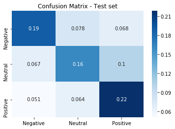
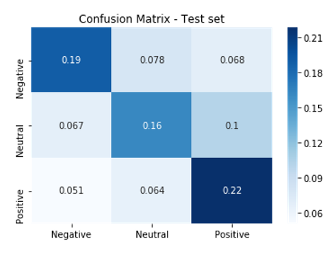

With 22% of US adults indicating they use Twitter, the platform has become a key stage where the climate change conversation unfolds. As such, this project hoped to understand—and visualize—Americans’ views of climate change as seen through the lens of Twitter.

### Method 

The approach was two-pronged: 
1. Develop a multi-layered predictive model trained with labeled data.
2. Create interactive visualizations housed on a dedicated webpage that facilitates comprehension and boosts engagement. 

An important distinguishing characteristic of this project is that it aimed to look past the accuracy of an analytical product and relate the sentiment data to demographic characteristics. It also casts a wider net when collecting raw data, incorporating both critical keywords (i.e., “climate change” and “global warming”) and popular hashtags (e.g., #parisagreement, “#climatehoax”) that represent both sides of the conversation. 

Like previous approaches, this relies heavily on extracting sentiment from Twitter. Uniquely, the sentiment measurement system operates by combining previous NLP analysis research and hashtag inference. By layering several models, it is effectively creating a boosting network that relies on the weighted sum of all of its sentiment learners to create one strong learner capable of more accurately predicting sentiment. 

##### 1. Labeled Data Collection

This project utilized the following labeled datasets for training the predictive models: 
1. [Sentiment Analysis – Global Warming/Climate Change](https://www.figure-eight.com/data-for-everyone/)
2. [Climate Change Sentiment](https://github.com/edwardcqian/climate_change_sentiment)
3. [Twitter Climate Change Sentiment Dataset](https://www.kaggle.com/edqian/twitter-climate-change-sentiment-dataset)

##### 2. Preprocessing

To prepare the data for the bag of words sentiment prediction and visualization stages, the raw tweets were cleaned to extract any useful components (e.g., isolate tweet from full text pulled in with Twitter API; extract location). A pipeline was created that removed non-standard characters, tokenized words in a tweet, removed stop words and stems the resulting set of words. A vocabulary was generated from this set of words to vectorize tweets and implement a TFIDF transformation. Then the data was enriched using LDA topics and hashtag encodings. 

##### 3. Modeling

Leveraging the labeled climate change dataset, different algorithms were tested for the bag of words model and used an ensemble voting model composed from the following classifiers: 

* Multinomial Naïve Bayes  
* Multi-layer perceptron classifier model 
* Linear support vector classifier

The voting classifier used a hard-voting system with mostly default hyperparameters. Some adjustments were made to the number of iterations for the multi-layer perceptron, and the number of hidden neurons. 

The BERT model leveraged a pretrained model and trained over it, tweaking hyperparameters as needed.  

### Model Evaluations

##### Bag of Words Model

###### Model Comparison - Accuracy

| Classifier                |  Training Set | Test Set  |
| ------------------------- | ------------- | --------- |
| Logistic Regression       | 73.1%         | 56.8%     |
| Linear SVC                |  81.0%        | 56.4%     |
| Multinomial Naïve Bayes   | 70.0%         | 55.3%     |
| Multi-layered Perception  | 88.5%         | 57.3%     |
| Ensemble                  | 81.4%         | 59.1%     |

###### F1 Score - Test Set

| Classifier  |  Negative | Neutral  | Positive |
|:---|:---:|:---:| :---: |
| Logistic Regression  | 0.61 | 0.49  | 0.59 |
| Linear SVC  |  0.59 | 0.52  | 0.59 |
| Multinomial Naïve Bayes  | 0.60  | 0.46  | 0.59 |
| Multi-layered Perception  | 0.61  | 0.54  | 0.57 |
| Ensemble  | 0.59  | 0.51  | 0.61 |

The ensemble model performed best when using the bag of words approach. However, the large gap between in-sample performance and out-of-sample performance indicates that overfitting may have occurred. 
This had to be contended with when working with a limited training sample size, particularly when it came to obtaining enough "negative" tweets. Even still, the confusion matrix shows a strong performance while maintaining an evenly divided error rate.

##### BERT Model  

###### BERT Accuracy

|---
| Iterations | Training | Test 
| :- | :-: | :-: 
| 1 | 72.5% | 66.9% 
| 2 | 92.2% | 65.6% 
| 3 | 95.1% | 67.5% 

###### BERT F1 Scoring

| Class | Precision | Recall | F1 | Support |
| :--- | :---: | :---: | :---: | :---: |
| Neutral | .68 | .60 | .64 | 1251 |
| Believer | .69 | .72 | .71 | 1274 |
| Skeptic | .68 | .73 | .70 | 1224 |
| Accuracy |  | | .68 | 3749 |

The model consists of two parts, the first of which is a text encoder that transforms tweets into vectors. These are then used in the second part as features. This second part is a deep recurrent neural network that comes "out-of-the-box" with pre-trained weights, which are adjusted as new data is applied in the training step. As can be seen, the validation accuracy during training remained roughly constant throughout the training process, which is a sign of severe overfitting to the training data.    

### Results

The BERT model was used to classify close to 200,000 tweets relating to global warming, geotagged within the United States over the last ten years. At current Americans overwhelmingly embrace anthropogenic climate change.
A possible explanation is that Twitter amplifies the voices of a non-representative part of the American population. Specifically, while 22% of Americans as a whole use Twitter, 32% of college-educated adults, 26% of urban citizens, and 38% of adults between the ages of 18 and 29 do so. This shows a clear skew towards a segment of the population that one would expect to endorse human-caused climate change.

The results of the experiment reveal that the reach of the climate change discussion has been following a drastic upward trend since the start of 2018, with hundreds of tweets being sent out a day. The more people discuss climate change on Twitter, the more “positive” the overall sentiment has become, with AGW believers outweighing the skeptics. This is evident in seeing previously fully skeptic states transition to nearly full believers within the last year.
 