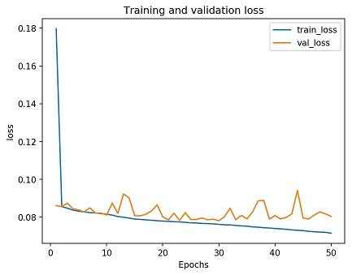
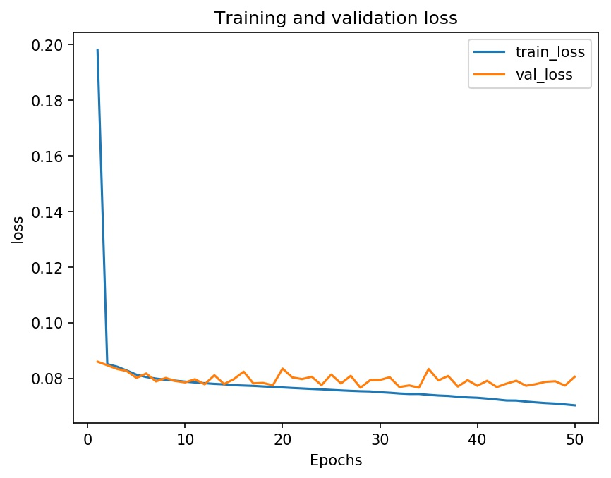

During data analysis I found various potential pitfalls in the AVA database that could introduce unwanted biases into the final model. Here is a brief overview as a quick recap:

* There exist photos with political, advertisement, pop culture, or emotional bias.
* The weighted average scores per photo are strongly centralized around 5/10. 

These pitfalls independently can heavily influence my final model; from making it prefer a certain political ideology, to generalizing all its predictions to 5/10. Both of which will impact the final performance and prevent what I really want the model to do: tell me with utmost certainty which photo is the best. 

## Data Preprocessing

The best way to go about alleviating my concerns was to simply remedy them prior to training the model. Cleaning and reshaping the data in advance enabled me to directly affect the performance of my model. I performed the following steps as a part of my data preprocessing:

1. Instance Selection
2. Feature Engineering
3. Normalization
4. Data Preparation

### Instance Selection 

Instance selection is a bit of a magic bullet that can improve training performance and the overall accuracy of the algorithm. By removing noisy or unwanted data the model is able to train faster and avoid developing unwanted data relations. It’s therefore perfect for reducing the unwanted biases listed above. 

With all of the data being associated with a challenge, and some being labeled with tags, this step was as easy as deleting all instances of certain challenges and tags from the database. This immediately separated my approach from previous research on this topic.

Unlike other papers[[1](https://arxiv.org/pdf/1707.03491.pdf), [2](https://arxiv.org/pdf/1606.01621.pdf), [3](http://infolab.stanford.edu/~wangz/project/imsearch/Aesthetics/ACMMM2014/lu.pdf)] I decided to remove hand-chosen photos from the dataset and keep black and white photos in place. This is under the assumption that the hand-selected photos will have more of a negative impact, and so long as the black and white photos are remapped to three color channels they’ll still provide useful information for the final model. 

#### Tags 



First up was deleting the tags. Even though during analysis I said that the tags weren’t a good representation of the database, they still provide some representation that can be utilized for cleaning purposes. The following are the list of tags that I removed from the final dataset:


|-|-|-|-|
| Advertisement | Astrophotography | Diptych | Emotive |
| Fish | Horror | Humorous | Infrared |
| Lensbaby | Overlays | Photo-Impressionism | Pinhole/Zone | 
| Political | | | |

Advertisement, Emotive, Horror, Humorous, and Political are self-explanatory as being directly associated with one of the pitfalls listed above. Meanwhile Astrophotography, Diptych, Fish, Infrared, Lensbaby, Overlays, Photo-Impressionism, and Pinhole/Zone are all tags which produce non-standard photo variants that wouldn’t be achievable with a standard camera lens, and therefore is outside my model’s target audience of amateur photographers. 

Deletion of the tagged photos resulted in the removal of nearly 29k photos from the dataset.

#### Challenges 



Challenges are where I was able to remove a majority of unwanted data. A quick visual glance at all the challenge names showed that multiple challenges contained the same words, or were even the exact same with an incrementing number to differentiate between them. This provided context in creating wildcard name lookups to use for deletion. Any challenge that contained the following wildcard words, ignoring case, were removed from the dataset:

|-|-|-|-|
| advertisement | album_cover | design | diptych |
| fear | hate | horror | humor |
| impressionism | irony | joke | love | 
| lucky | magazine_cover | nightmares | oops |
| oxymoron | postcard | poster | propaganda | 
| song | spam | triptych | visual_puns | 
| wheres_waldo | | | | 

However, just using wildcards wasn’t enough. Some challenges rely on unique pop culture names, or didn’t match any of the wildcards.  I analyzed each of the remaining challenges, by looking at their names and visualizing a random sampling of the photos, and was able to hand remove the following challenges:

|-|-|-|-|
| Automobile_Ad | Automobile_Ad_II | Bond_James_Bond | Cheater! |
| Dr._Seuss | Faces_in_Household_Items | Got_Milk_Portrait | Hidden_Faces | 
| I_Bought_It_On_eBay | Language | Misquotes | Misunderstanding |
| Monty_Python | Multi-Image_Compositions | Nostalgia | Phobia |
| Pi | Pi_II | Stupid_Gifts | Stupid_Stupid! | 
| Tarot_Card | Tilt_shift | Vanish | What |

As mentioned, these hand selected challenges rely on a lot of emotional or pop cultural references, which I didn’t want impacting my final model. I wouldn’t want someone’s ability to recreate a Tarot Card to skew how my model rates a photo. 

After all the challenges and tags were removed I was left with a dataset containing only 219k images, a little over ¾ of what I started with. 

### Feature Engineering 



After removing unnecessary data the next step was to engineer certain features from the dataset into smaller derived values in order to remove redundancy in the data. For the AVA database this involved transforming all of the rating information into a single score value. 

During analysis the scores were calculated using a standard weighted average, where the assigned weights were just the star rating. However, this is what led to there being a large spike in Figure 3, showcasing an abundance of scores at the median value. Even though the weighted average calculates a photo’s true score, it isn’t conducive to what I need. 

Ultimately I wanted to find a way to calculate the scores that would improve the model inference. This meant expanding out the data to create more of a curve to replace the spike. 

Luckily the data analysis showed that the challenges provided consistency in the ratings a photo received, allowing me to utilize the analysis data to create a formula that would modify each rating’s weight on a per-photo basis. 



The long and the short of the algorithm is building up a “confidence rating” by combining bayesian confidence with a generated confidence based on the number of votes the photo received in relation to the challenge and the global database. This confidence is then applied to the standard deviation of each rating, effectively creating a new weight value for that rating. 

The final result produced higher weights for photos with more votes, and therefore more confidence in the reporting numbers, and weights closer to the standard weighted average for photos with less confidence. Figure 4 shows that the histogram of my engineered scores no longer has a sharp peak and encompasses a much wider range of scores. 

I assume that, ordinarily, completely modifying data (somewhat) arbitrarily is considered bad practice. However, my intended goal isn’t to predict the actual scores the photos received, but instead predicting the relative score between similar photos in my camera roll -- so it’s A-okay. 

### Normalization 

Once the data had been engineered into a state I was happy with, it was time to prepare it for the model itself. The purpose of normalization is to ensure that each feature exists on the same scale, and is therefore seen as equally important when processed by the model. Since I had already corrected the distribution of the data during the feature engineering phase I chose to use the min-max algorithm for my normalization. 

Min-max transforms the smallest score into a 0, the largest into a 1, and every other value gets transformed into a decimal between 0 and 1. This is great because it helps “unsquish” any clumps of data and it naturally maps the data to the same range as used by decimal ratings. So not only will it help the model find trends, but I can use the raw prediction output as a direct percentage rating for the image. 

### Data Preparation 

Now that all the data is formatted correctly it was time to prepare it for TensorFlow by creating TFRecords. A TFRecord is a way to easily save the data to disk as a sequence of binary strings, allowing for persistent access when going to train a model. 

Each TFRecord contains multiple Examples where one Example is an input and target output pair to train the model on. The below code showcases my Example creation, where I transformed grayscale images to rgb channels, encoded the image into a serialized array, and stored the shape of the image along with its associated score:

```python 
def create_example(image, score):
    image = get_image(image) # loads image from file
    
    if image.shape[2] < 3:
        image = cv2.cvtColor(image, cv2.COLOR_GRAY2RGB)
    
    image_data = tf.io.serialize_tensor(image)
    
    return Example(
        features=Features(
            feature={
                "image/encoded": Feature(bytes_list=BytesList(value=[image_data.numpy()])),
                "image/height": Feature(int64_list=Int64List(value=[image.shape[0]])),
                "image/width": Feature(int64_list=Int64List(value=[image.shape[1]])),
                "image/channels": Feature(int64_list=Int64List(value=[image.shape[2]])),
                "image/label": Feature(float_list=FloatList(value=[score]))
            }
        )
    )
```

Notice how I only transformed the image from grayscale to color, everything else was saved as is. This was to allow the model training pipeline to perform its own preprocessing on the raw image data and reshape it into the expected input for the model. 

For example, below showcases loading the above TFRecord then normalizing and reshaping the image to match the model’s expected input dimensions:

```python 
def preprocess(tfrecord):
    feature_descriptions = {
        "image/encoded": tf.io.FixedLenFeature([], tf.string, default_value=""),
        "image/height": tf.io.FixedLenFeature([], tf.int64, default_value=-1),
        "image/width": tf.io.FixedLenFeature([], tf.int64, default_value=-1),
        "image/channels": tf.io.FixedLenFeature([], tf.int64, default_value=-1),
        "image/label": tf.io.FixedLenFeature([], tf.float32, default_value=-1.)
    }
    
    example = tf.io.parse_single_example(tfrecord, feature_descriptions)
    
    image = tf.io.parse_tensor(example['image/encoded'], out_type=tf.uint8)    
    height = tf.cast(example['image/height'], tf.int32)
    width = tf.cast(example['image/width'], tf.int32)
    channels = tf.cast(example['image/channels'], tf.int32)
    
    image = tf.reshape(image, shape=tf.stack([height, width, channels]))
    image = tf.cast(image, tf.float32) * (1. / 255.)
    
    image = tf.image.resize(image, [224, 224])
    
    return image, example["image/label"]
```

When combined with `tf.dataset.map(preprocess)` I created an iterable dataset which prefetched the cleaned data from disk and preprocessed it into a format for training. 

This pipeline easily allowed me to add buffering, batching, and any additional data augmentation  like `random_flip_left_right` which randomly flips images on the horizontal axis -- effectively doubling my training data. 

## Results 

<figure class="figure w-100">
	
	
	
	<figcaption class="figure-caption text-center">Fig 5. Raw AVA Database training loss (left) and Input Selected Dataset training loss (right).</figcaption>
</figure>

As a very basic proof of concept I trained a simple convolutional neural network on the raw data, input selected data, and the input selected data with my confidence scoring. Since the target data was in the range 0-1, with a steady curve in the middle, I chose to utilize a sigmoid activation function on the last node of the graph optimized with stochastic gradient descent.  

The good news is that the input selected dataset took half the time to train and followed nearly the exact same trend when compared to the raw dataset. The input selected actually performed more consistently on the validation data than the raw dataset. So, by removing all the tags and challenges I ended up not impacting the final model’s prediction, instead I gained a lot of performance and consistency during training. 



Oddly enough, even though my confidence-based scoring looks as though it follows the same trend, the final loss is significantly higher than the other two datasets. This is most likely due to the model itself being incredibly basic and not actually learning photo aesthetics for any of the datasets. It’s just that with the naive weighted average the model can reliably cluster around 5/10 and get a low loss, while my scores are more spread out and therefore rely on actual learning. 

Hopefully once I design a proper model to train on this dataset I will be able to utilize the confidence-based scoring to its full potential. 

