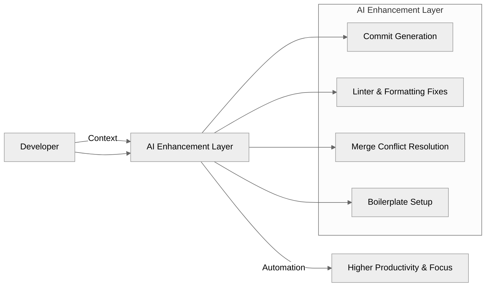

When engineers talk about productivity, we often focus on tools.
But the real measure of productivity is flow. That uninterrupted rhythm where focus turns into progress.

As a Principal Engineer, I’ve spent years refining how I work. My editor is tuned exactly the way I like it, my linting rules are strict but purposeful, and my terminal feels more like home than any commercial IDE. When I’m in that environment, I move faster, think clearer, and build better.

So when AI-powered IDEs started making their way into everyday workflows, I wanted to believe in them. They promised to make developers faster, but the moment I stepped inside one, that flow disappeared. The shortcuts I relied on were gone, the layout felt foreign, and the LSPs I needed weren’t there.


**AI shouldn’t replace your workflow; it should enhance your flow.**


At first, I tried to adapt. I jumped between my terminal and the AI IDE, switching contexts just to give it a fair chance. But every session felt slower, more frustrating. The results weren’t matching what I envisioned. It took longer to describe the solution I wanted than to simply write it myself. That’s when my skepticism about AI tools started to grow.

### A smaller, quieter insight

Still, I noticed one small thing that kept me coming back. The IDEs were good at writing commit messages. Not perfect, but consistent. It made me realize that while I didn’t want AI building my systems, I *did* want it handling the repetitive parts of my job so that I could stay focused on problem solving.

That idea stayed with me. Developers shouldn’t have to change their environments to benefit from AI. The better path was to bring AI into the tools we already use, right where it can make the biggest impact with the least intrusion.

That was the moment I started building **Git AI**.


### Automating the boring parts

Git AI doesn’t try to write your code. It enhances the parts around it.
One of its first features, `git ai commit`, takes a messy Git state and turns it into clean, conventional commits. Instead of one vague message, it organizes your changes into logical, well-scoped entries that make sense to anyone reading the history later.

**Before:**

```bash
git add .
git commit -m "did stuff"
```
**After:**

```bash
git ai commit

# Output:
feat(auth): add OAuth2 token refresh logic
refactor(api): simplify request validation
fix(config): correct environment variable parsing
```

The history becomes a story again. The output is consistent, readable, and aligned with best practices. What used to take minutes of manual sorting now happens instantly, leaving developers to focus on the work that actually matters.

---

### Where AI fits in

That experience reshaped how I view AI in development.
It doesn’t belong in a separate window, or as a replacement for human judgment. It belongs in the quiet spaces between effort where it can reduce friction without removing control.



By placing AI inside the workflow, right next to the tools we already trust, it stops feeling like an interruption and starts becoming part of the process.

### What happens when friction disappears

When the mundane is automated, creative capacity expands.
The focus shifts from syntax and style to architecture and design. Engineers can think further ahead, build with more intent, and spend time solving problems that matter.

I’ve seen this change happen firsthand. Once AI takes care of commits, merges, or pre-commit checks, developers move with more confidence. They experiment more, refactor more, and contribute with fewer distractions. The workflow feels lighter, yet the output is stronger.

That’s what it means to *boost* a workflow. Not replacing the human, but to giving them more space to create.


### The future of enhancement

Git AI started as an experiment in how to use AI to complement human craftsmanship. It’s a small tool, but it represents a larger idea: that AI doesn’t have to take center stage to make an impact. The quietest improvements often have the most lasting effect.

If you’d like to see what that feels like, you can try it today. I’d love to hear what you think, and how it could better fit your workflow.


As of writing this Git AI is still in alpha. Feedback and ideas are welcome on the [GitHub repository](https://github.com/mattstruble/git-ai).



Boost your workflow. Keep your flow.
